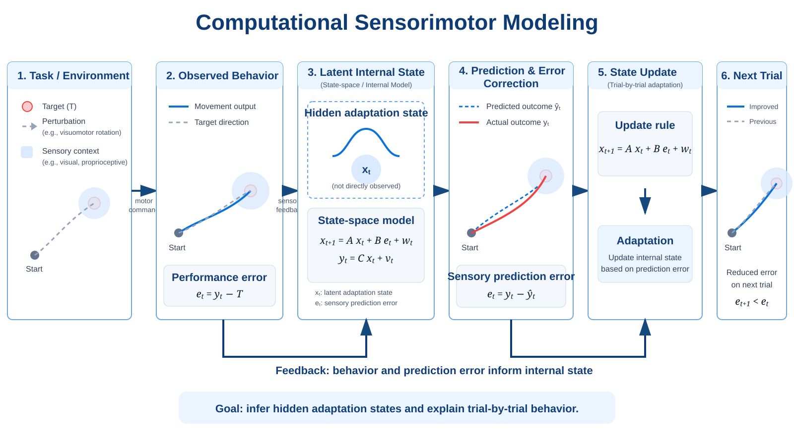
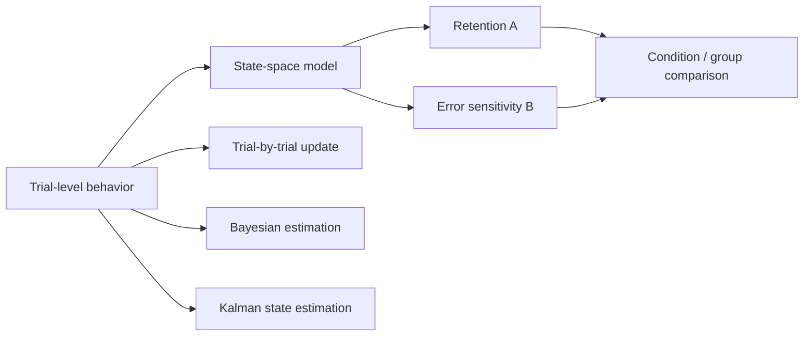

# Computational Sensorimotor Modeling

<p align="center">
  
</p>

[](https://github.com/itoitoakaaka/computational-sensorimotor-modeling/actions/workflows/tests.yml)

Interpretable, reproducible models for trial-by-trial human sensorimotor adaptation.

This repository is the computational companion to experimental work on how human behavior changes across environments. The public examples are synthetic. The code is structured so de-identified participant-level trial data can be analyzed without changing the modeling API.



## What is implemented

- one-state error-based adaptation model
- trial-by-trial error-to-correction regression
- bounded parameter fitting
- parameter-recovery tests
- grid-based Bayesian posterior for retention and error sensitivity
- scalar Kalman filtering for latent-state estimation
- participant-level CSV analysis
- command-line interface
- automated tests on Python 3.10-3.12 with GitHub Actions

## Model

The core adaptation model is

```text
x[t+1] = A * x[t] + B * e[t] + w[t]
y[t]   = x[t] + v[t]
```

where `A` is retention, `B` is error sensitivity, `w` is process noise, and `v` is observation noise.

The parameters are model-dependent summaries. They are not direct measurements of biological mechanisms.

## Install

```bash
git clone https://github.com/itoitoakaaka/computational-sensorimotor-modeling.git
cd computational-sensorimotor-modeling
python -m venv .venv
source .venv/bin/activate
pip install -e ".[dev]"
```

## 30-second demo

Run a synthetic participant-level analysis:

```bash
sensorimotor-fit
```

Generate a synthetic adaptation figure:

```bash
python examples/synthetic_demo.py
```

Run the test suite:

```bash
pytest
```

## Analyze de-identified trial data

Input CSV:

```text
subject_id,condition,group,trial,target,observed
S01,Land,Experienced,0,0.0,0.03
S01,Land,Experienced,1,1.0,0.22
```

Required columns:

- `subject_id`
- `trial`
- `target`
- `observed`

`condition` and `group` are optional. Use anonymous IDs only.

```bash
sensorimotor-fit --input my_trials.csv --output output/participant_parameters.csv
```

The output contains participant-level retention, error sensitivity, state-space fit error, trial-by-trial correction gain, and R².

## Repository layout

```text
src/sensorimotor/
  state_space.py
  trial_by_trial.py
  bayesian.py
  kalman.py
  io.py
  analysis.py
  cli.py
examples/
tests/
.github/workflows/tests.yml
MATH_NOTES.md
EXTERNAL_OUTPUT_PLAN.md
```

## Reproducibility stance

The repository deliberately separates:

1. **Measured behavior** — trial-level observations.
2. **Model estimates** — parameters inferred under explicit assumptions.
3. **Biological interpretation** — claims that require converging experimental evidence.

The tests check parameter recovery, basic Bayesian recovery, Kalman denoising, participant-level fitting, and input-schema handling.

## Current limitation

The public repository does not include participant data. Results shown by the examples are synthetic and are not presented as findings from a human experiment.

The next research step is to apply the same tested pipeline to a de-identified, publishable behavioral dataset and add model comparison and uncertainty analyses.

## Mathematical notes

See [`MATH_NOTES.md`](MATH_NOTES.md) for a compact bridge from trial-by-trial learning to likelihood, Bayesian parameter estimation, and Kalman filtering.
